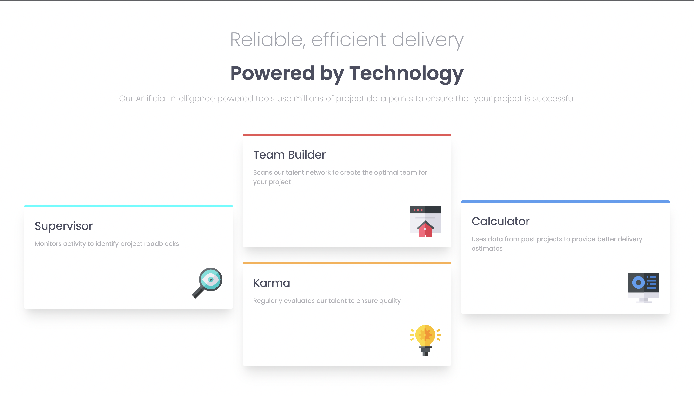

# Frontend Mentor - Four card feature section solution

This is a solution to the [Four card feature section challenge on Frontend Mentor](https://www.frontendmentor.io/challenges/four-card-feature-section-weK1eFYK). Frontend Mentor challenges help you improve your coding skills by building realistic projects. 

## Table of contents

- [Overview](#overview)
  - [The challenge](#the-challenge)
  - [Screenshot](#screenshot)
  - [Links](#links)
- [My process](#my-process)
  - [Built with](#built-with)
  - [What I learned](#what-i-learned)
  - [Continued development](#continued-development)
- [Author](#author)

**Note: Delete this note and update the table of contents based on what sections you keep.**

## Overview

### The challenge

Users should be able to:

- View the optimal layout for the site depending on their device's screen size

### Screenshot



### Links

- Solution URL: [https://github.com/Divjas-Singh/four-card-feature-section-master](https://github.com/Divjas-Singh/four-card-feature-section-master)
- Live Site URL: [https://divjas-singh.github.io/four-card-feature-section-master/]([https://your-live-site-url.com](https://divjas-singh.github.io/four-card-feature-section-master/))

## My process

### Built with

- Semantic HTML5 markup
- CSS custom properties
- Flexbox
- CSS Grid
- media queries
- [Styled Components](https://styled-components.com/) - For styles

**Note: These are just examples. Delete this note and replace the list above with your own choices**

### What I learned

I learned the use of grid to make different layouts and making the layout responsive using media queries

```css
@media screen and (max-width:800px) {

  html{
    font-size: 55%;
  }

}
@media screen and (max-width:700px) {
  body{
    height: auto;
  }
  main{
    grid-template-columns: 1fr 1fr;
    grid-template-rows: 1fr 1fr;
  }

  #card1{
    grid-row: auto;
  }
  #card4{
    grid-row: auto;
    grid-column: auto;
  }
  .card{
    align-content: auto;
  }
}
@media screen and (max-width:700px) {
  main{
    grid-template-columns: 1fr;
  }
}
@media screen and (max-width:450px) {
  header h1, header h2{
    font-size: 2.5rem;
  }
  header p{
    font-size: 1.3rem;
  }
}

@media screen and (max-width:450px) {
  header h1, header h2{
    font-size: 2rem;
  }

}
```


### Continued development

using media queries and creating responsive pages


## Author

- Website - [Divjas Singh Anand](https://www.your-site.com)
- Frontend Mentor - [@Divjas-Singh](https://www.frontendmentor.io/profile/yourusername)


